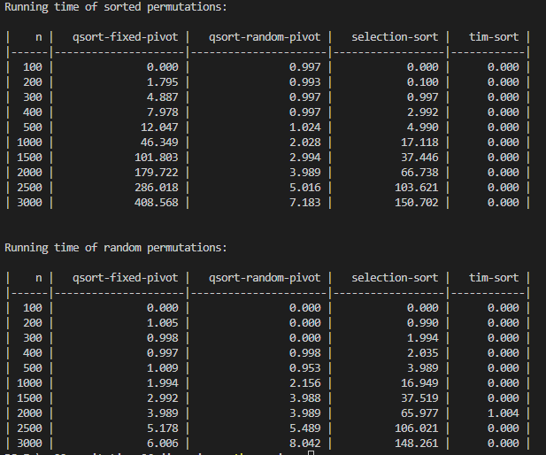

# CMPS 2200 Reciation 6
## Answers

**Name:** Ruoqin Ji

Place all written answers from `recitation-06.md` here for easier grading.

- **1b.**

    The results of running time of sorting a pre-sorted list (e.g., list in ascending order in this case) is attched below.
    

    We can see from the plot that the runtime of quick sort with random selected piviot can be desribe as a function of $0.0008x\log x$, which means that its $W(n) = O(n\log n)$. 

    For both quick sort with fixed piviot and selection sort, they take relatively longer time. Their run time can be both represented by linear combinations of quadratic functions. In other words, their $W(n) = O(n^2)$.

    If we use a random list rather than a pre-sorted list, something interesting happen. The results are attached below.
    
    The run time of quick sort with fixed pivot greatly decreases and becomes close to quick sort with random piviot. This is also intuitively correct because consistently selecting the first element of a random list producres a random piviot. 

- **1c.**
    The plot of runtime of quick sort and timsort is attched below. 
    
    
    We can tell taht the timsort is incredibly fast. I think that's probably why it's Python's sorting function.